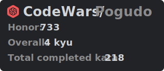
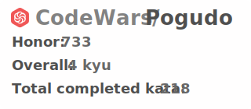

# Виджет CodeWars

---
## Цель проекта
Виуализация достижений и побед пользователей на платформе codewars в более дружелюбном варианте.

---
## Реализация

- Получание данных от пользователя с помощью *get* запроса в **FastAPI** через форму ввода.
- Переход по шагам генератора с помощью библиотеки stepper-js
- Верстка html-страницы на основе шаблона ceres который написан на фреймворке bootstrap
- Выбор темы оформления dark и light
- Запрос к API *CodeWars* имея **user_name** пользователя.
- Генерация интерактивного файла .svg (без сохранения на жестком диске) изображения с полученными данными с помощью библиотеки **svgwrite**.
- При генерации кода испольхуется StreamingResponse, где настроено кэширование полученного результата
- Генерация на JavaScript кода для вставки с форматированием markdown

### TODO:
- ~~Добавить темы~~
- ~~Настроить кэширование на 3 часа~~
- ~~Добавить фоновое изображение~~
- ~~Добавить favicon~~
- ~~Прописать keywords~~
- ~~Почистить html/css/js~~
- Прикрепить ссылку на figma-file
- Создать docker-container
- Наполнить этот файл
- Запушить на repl.io
- Создать таск для апдейтов
- Создать анимацию появления svg
- Добавить страницу с выбором строк для добавления

