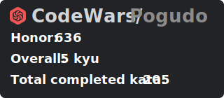

# Виджет CodeWars

---
## Цель проекта
Виуализация достижений и побед пользователей на платформе codewars в более дружелюбном варианте.

---
## Реализация
#### version 0.1 (BETA)
- Получание данных от пользователя с помощью *get* запроса в **FastAPI**.
- Запрос к API *CodeWars* имея **user_name** пользователя.
- Генерация (.png) изображения с полученными данными с помощью библиотеки **pillow**.

---
#### version 0.2-beta
- Убраны ошибки при выполнении
- Переписан код с процедурного на ООП
- Добавлена задержка выполнения для уменьшения количества запросов

---
#### version 0.3-svg

- Переход на .svg формат
- Устранение ошибок
- Изменение размеров
---
