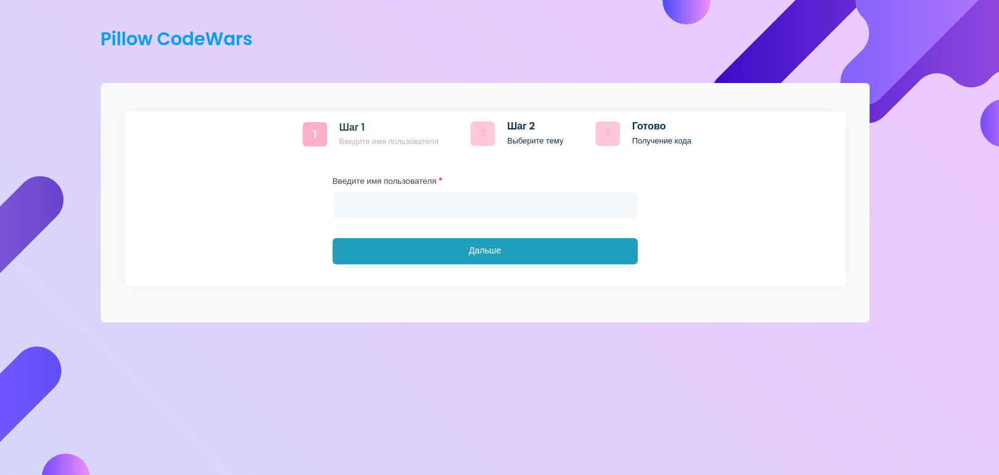
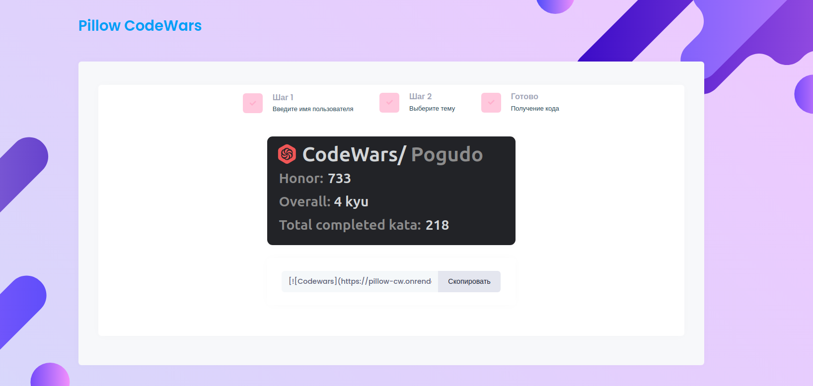

 

# Виджет CodeWars

---
## Цель проекта
Виуализация достижений и побед пользователей на платформе codewars в более дружелюбном варианте.

---

## Как пользоваться
Перейдите на [сайт](https://pillow-cw.onrender.com/) и введите свое имя пользователя используемое на [CodeWars](https://codewars.com).

Следующим шагом выберите понравившуюся тему и получите код для вставки:

На этом всё, данные полученного изображения будут обновляться каждые 3 часа, начиная с этого момента.

---
## Реализация

- Получание данных от пользователя с помощью *get* запроса в **FastAPI** через форму ввода.
- Переход по шагам генератора с помощью библиотеки stepper-js
- Верстка html-страницы на основе шаблона ceres который написан на фреймворке bootstrap
- Выбор темы оформления dark и light
- Запрос к API *CodeWars* имея **user_name** пользователя.
- Генерация интерактивного файла .svg (без сохранения на жестком диске) изображения с полученными данными с помощью библиотеки **svgwrite**.
- При генерации кода испольхуется StreamingResponse, где настроено кэширование полученного результата
- Генерация на JavaScript кода для вставки с форматированием markdown

---

### TODO:
- Прикрепить ссылку на figma-file
- Создать docker-container
- Наполнить этот файл
- Запушить на repl.io
- Создать таск для апдейтов
- Создать анимацию появления svg
- Добавить страницу с выбором строк для добавления

